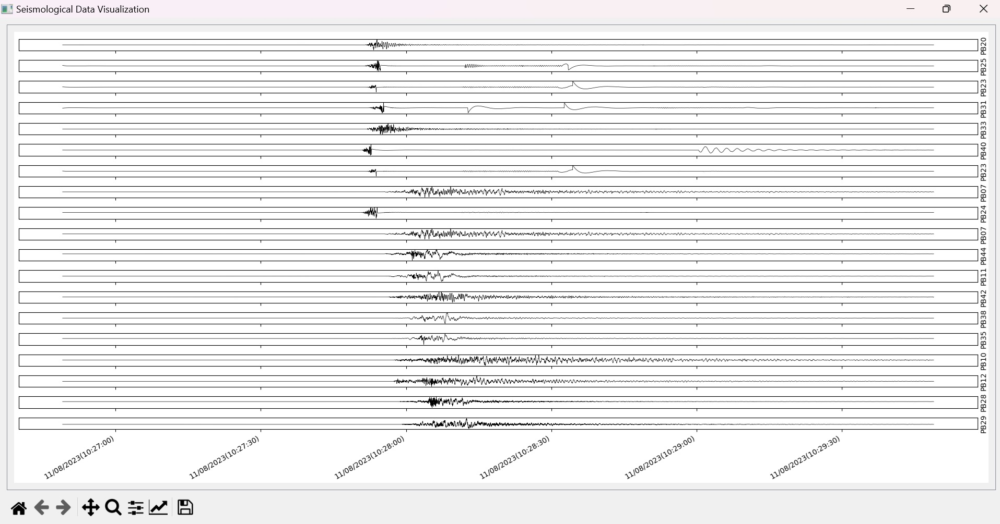

# Earthquake-Data-Visualizer
# Author: Sparsh Rawlani
# Date: 06/11/2024


## Purpose: Assessment for Software Developer Role at University of Texas Austin's Bureau of Economic Geology.


## Instructions on How to Build and Run:
Welcome to the Seismology Application project! Follow the steps below to set up and customize the project for your needs.

### 1. Clone or Download the Project

- **Clone the Repository**:
  git clone https://github.com/yourusername/seismologyApp.git

- **Alternatively, Download as ZIP**:
  - Go to the GitHub repository page.
  - Click on the "Code" button.
  - Select "Download ZIP".
  - Extract the downloaded ZIP file to your desired location.

### 2. Install Required Packages

Open your python compiler/IDE, and then,install the following packages: (I recommed using PyCharm to build the entire project)
- PyQT5
- obspy
- matplotlib

### 3. Edit `main.py` File

- Open the `main.py` file in your preferred text editor.
- Locate line 19.
- Change the file path to point to the location of your `quakeml` file on your device.

Example:
```python
quake_ml_file = "path/to/your/quakeml/file"
```

### 4. Modify `seismologyApp.py` for Stations

- Open the `seismologyApp.py` file in your preferred text editor.
- Locate line 30.
- Add or remove stations as needed.

Example:
```python
stations = ['PB13', 'PB14', 'PB15']
```

### 5. Run the Application

After completing the above steps, you can run the application by running the main.py file.

## Summary of Steps

1. **Clone/Download**: Get the project from the GitHub repository.
2. **Install Packages**: Install necessary dependencies, namely, PyQt5, matplotlib, and obspy.
3. **Edit `main.py`**: Update line 19 to point to set the destination to your `quakeml` file.
4. **Modify `seismologyApp.py`**: Customize line 30 for the stations you want to include.
5. **Run Application**: Execute `main.py` to start the application.

Follow these steps to successfully set up and customize the Seismology Application. 

## How to Use the UI
1. After sucessfully executing main.py, you would see a UI screen that looks something like the one below. In order to pan/scroll left or right, first select the drag tool from the tool bar below (looks like a + sign) and then start dragging any seismogram left or right while holding the left key on your mouse.



2. For zoom features, scroll down on your mouse for zooming in or scroll up for zooming out.

## Refrences Used:
1. https://docs.obspy.org/packages/autogen/obspy.core.event.read_events.html
2. https://docs.obspy.org/packages/autogen/obspy.clients.fdsn.client.Client.get_waveforms.html
3. https://matplotlib.org/stable/plot_types/basic/plot.html#sphx-glr-plot-types-basic-plot-py
4. https://doc.qt.io/qtforpython-6/overviews/qtcharts-zoomlinechart-example.html
5. https://www.geeksforgeeks.org/qt-alignment-in-pyqt5/
